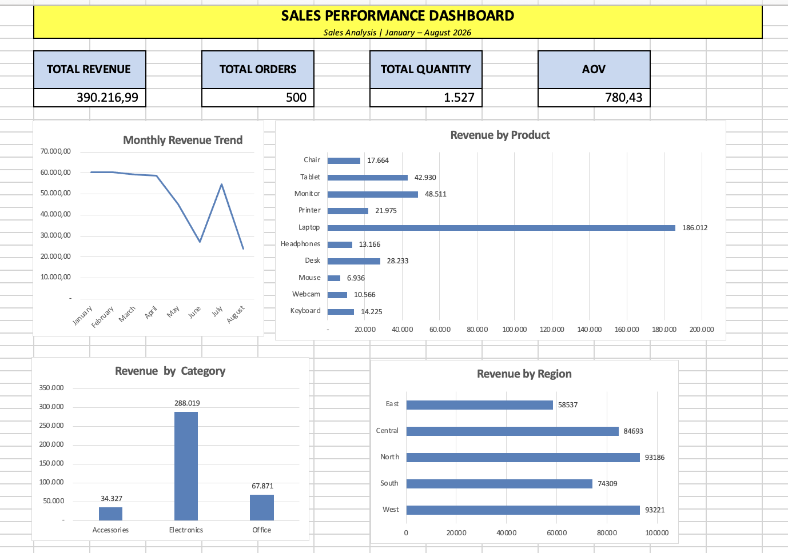

# Sales Analysis

## Project Overview

This project analyzes sales data to understand revenue performance, customer behavior, product performance, and regional performance.

## Dashboard

## Tools

- Microsoft Excel
- Git
- GitHub

## Key Insights

- Laptop generated the highest revenue among all products.
- Revenue declined significantly in June and August.
- West and North were the strongest-performing regions.
- Electronics was the largest revenue-generating category.

## Recommendations

- Launch targeted promotions for laptops, especially in high-performing regions.
- Develop back-to-school campaigns to increase sales during seasonal demand periods.
- Strengthen marketing activities in the West and North regions.
- Use product bundles, such as laptop + keyboard, to increase average order value.